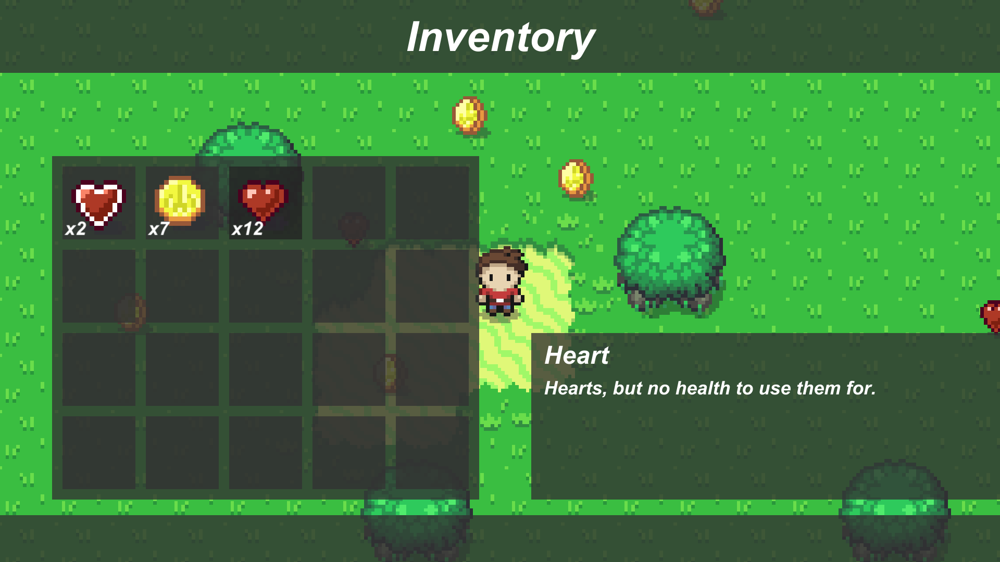
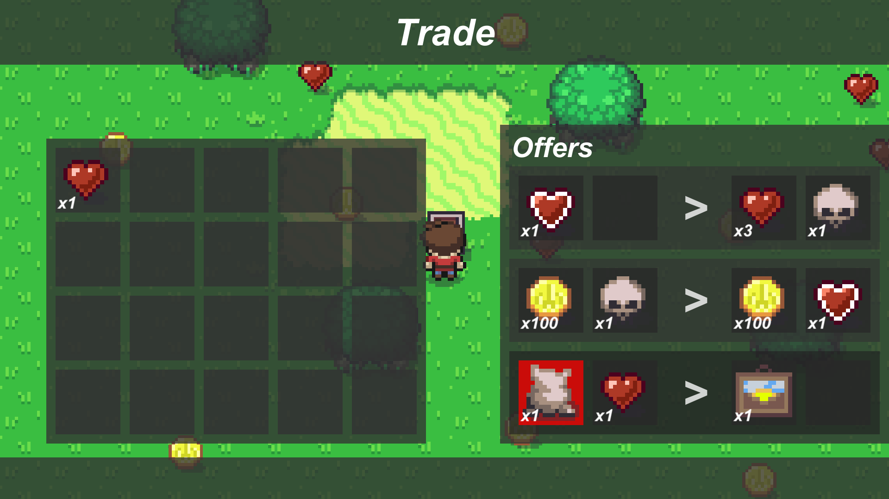

# Showcase
Demonstrating how [**schwer-scripts**](https://github.com/itsschwer/schwer-scripts) could be used. A playable demo is available on [itch.io](https://schwer.itch.io/showcase) *(p/w: `sch`)*.

</img>
</img>

## License
Unless otherwise specified, the contents of this repository are released under the [MIT License](https://github.com/itsschwer/Showcase/blob/master/LICENSE). Attribution is appreciated.

This project uses sprites from "[Zelda-like tilesets and sprites](https://opengameart.org/content/zelda-like-tilesets-and-sprites)" by [ArMM1998](https://opengameart.org/users/armm1998), licensed under [CC0](https://creativecommons.org/publicdomain/zero/1.0).
